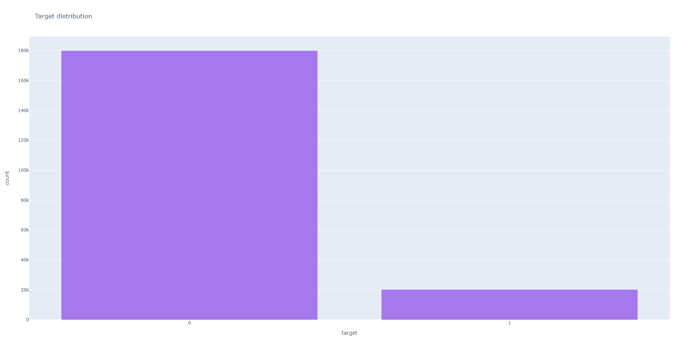
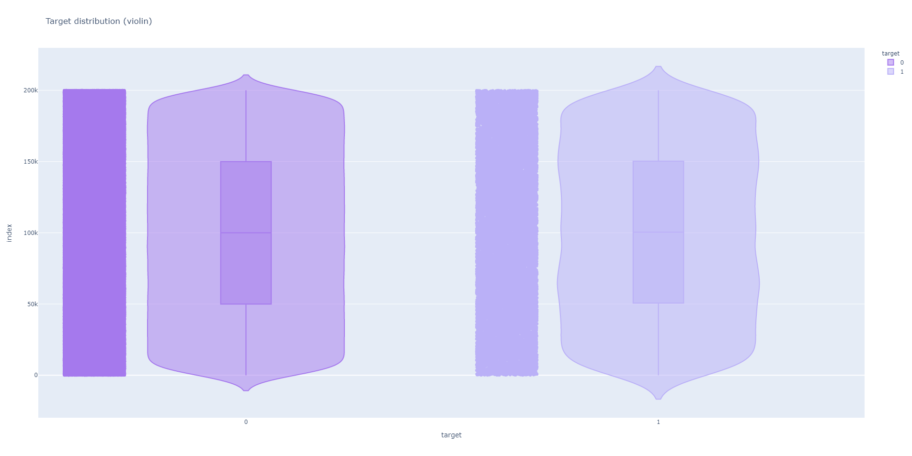
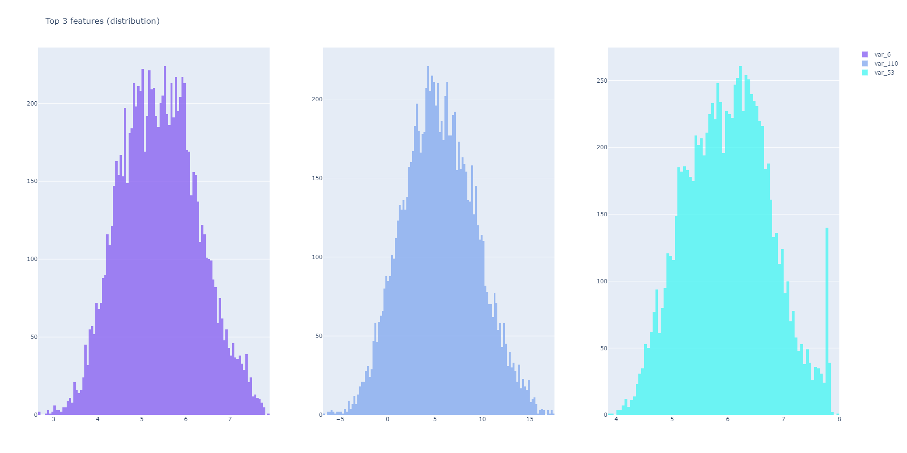
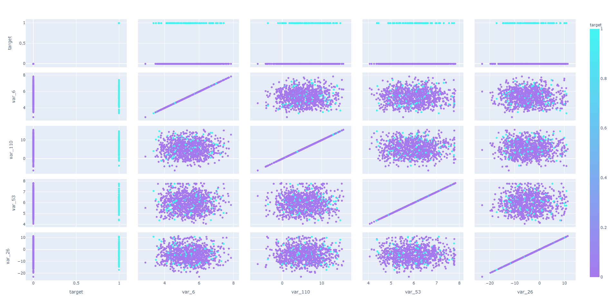
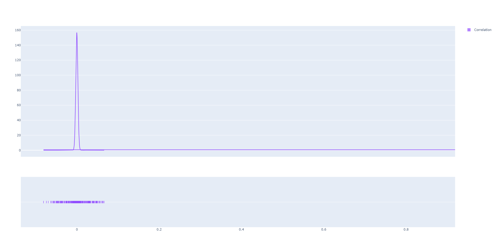
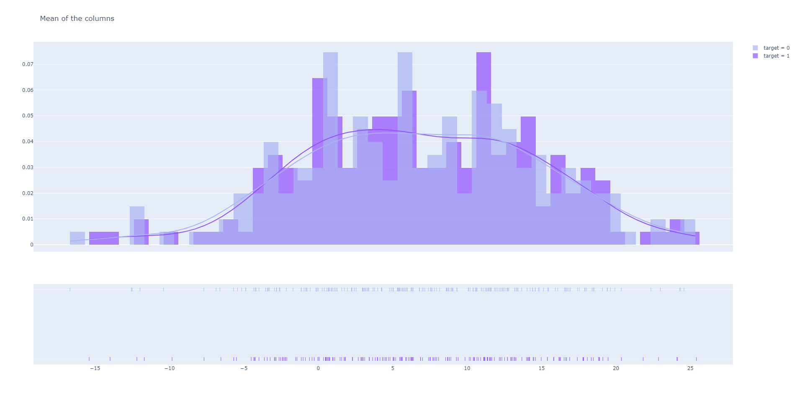
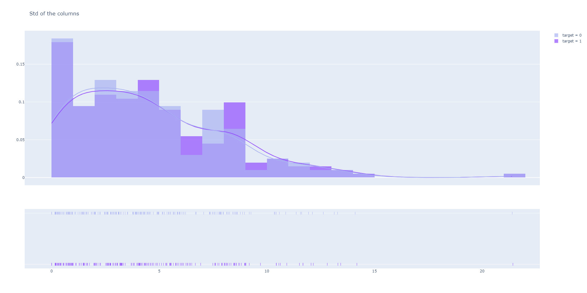
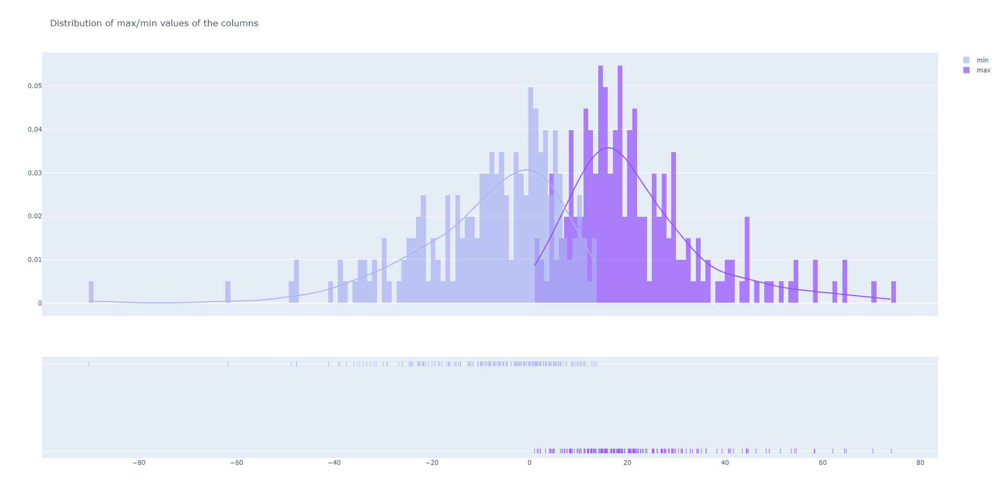
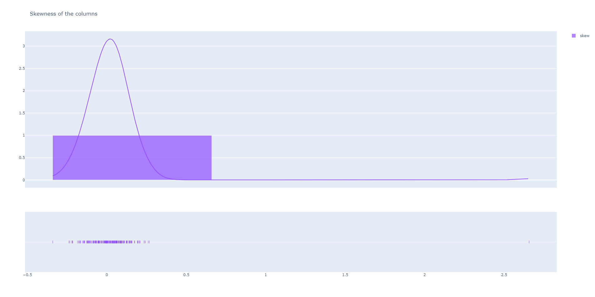

# Data analysis

The main task for us is using this data set to predict transactions of the customers (regardless of amount). The data comes from a real competition held by the Santander bank, so we are going to work with a pretty realistic example. The problem we are going to face is that the data is fully anonymized, which means that we cannot extract any information from the labels. They are encoded as val1, val2, val3 (...) etc. which can make data analysis a little bit harder. Just to wrap the most important information up:

- The bank states that the data has the same structure as the real data
- All features are numeric and anonymized
- Our goal is to solve a binary classification problem


## Exploring the data set

I usually try to make a table with all the features and display the example values but in this case it doesn't really make sense since all of them are numerical and we don't know what they represent. Below you can see the first four columns.

```python
   ID_code  target    var_0   var_1  ...  var_196  var_197  var_198  var_199
0  train_0       0   8.9255 -6.7863  ...   7.8784   8.5635  12.7803  -1.0914
1  train_1       0  11.5006 -4.1473  ...   8.1267   8.7889  18.3560   1.9518
2  train_2       0   8.6093 -2.7457  ...  -6.5213   8.2675  14.7222   0.3965
3  train_3       0  11.0604 -2.1518  ...  -2.9275  10.2922  17.9697  -8.9996
4  train_4       0   9.8369 -1.4834  ...   3.9267   9.5031  17.9974  -8.8104
```

```
              target          var_0  ...        var_198        var_199
count  200000.000000  200000.000000  ...  200000.000000  200000.000000
mean        0.100490      10.679914  ...      15.870720      -3.326537
std         0.300653       3.040051  ...       3.010945      10.438015
min         0.000000       0.408400  ...       6.299300     -38.852800
25%         0.000000       8.453850  ...      13.829700     -11.208475
50%         0.000000      10.524750  ...      15.934050      -2.819550
75%         0.000000      12.758200  ...      18.064725       4.836800
max         1.000000      20.315000  ...      26.079100      28.500700
```

```Python
Shape of the dataset:  (200000, 202)
Type of the information:  int64
Missing data:  0
```


## The target

The first thing I'm going to take care of is our target that represents whether a transaction took place.





From these two plots we can already say that:

- We have a very **imbalanced target** issue. The number of customers who don't take a transaction is much higher than one of those who do.
- I was hoping for some kind of relationship to the index that could provide more insight, sadly there doesn't seem to be one.
- Our target is very uniformly distributed.


## The features

### 1) Distribution against the target


Above we can see the target distribution grouped by features (first batch, you can run the function yourself to see the rest and see what I've been looking trough). Light purple represents people who didn't make a transaction, dark one represents those who did. By going trough the columns, I gathered following information:

- Some targets do have very different target distribution (ex. var_12)
- Most of the targets seem to have a normal distribution


### 2) Features with the highest correlation to the target

Now I'm going to check which features are most and least correlated to our target. I'm doing that the numerical way instead of doing the heatmap because there is simply a lot of features and it's more insightful to do it this way.

```Python
Most correlated to the target:
var_6      0.066731
var_110    0.064275
var_53     0.063399
var_26     0.062422
var_22     0.060558
var_99     0.058367
var_190    0.055973
var_2      0.055870
var_133    0.054548
var_0      0.052390
```

```python
Least correlated to the target:
var_165   -0.055734
var_80    -0.057609
var_166   -0.057773
var_21    -0.058483
var_174   -0.061669
var_76    -0.061917
var_146   -0.063644
var_12    -0.069489
var_139   -0.074080
var_81    -0.080917
```

There is two takeaways from these numbers:

- There doesn't seem to be a very straightforward correlation between the features and our target
- There is probably some kind of correlation between the features themselves that contributes to the deciding factor






- In some cases we can se a clear line where the scatter plots stop, it might signalise some kind of relationship between their meaning
- Most of the distribution is very random and we cannot spot much correlation, I think we need to wait until after training the model to extract the top features from it. Then we will be able to speculate more in-depth about the meaning behind them.
- We can spot that with these features, target value of 1 is significantly moved to the right
- Var_53 has a weird spike near the highest value that we also saw in some other features


### 3) Correlation between the features



The plot above displays the flattened array of correlation between the features. It's a good way to see if there is any correlation in the data set and to what degree, sadly in our case it seems like there is no information to extract. I speculate that it might be because the features are anonymized in such way that it's harder to assume their relationship and meaning.


### 4) Showcasing dataset description

Now I'm going to go trough the data set description (mean, std, min/max values) and plot the information. I'm doing this because sometimes we can get an interesting insight that could help with feature engineering. At worst we will learn a lot more about the data we're working with.











## Feature engineering

In this step I'm going to take a look at the features and see if I can extract any data about what they represent, if any new features could be created and if they would even influence the result somehow. Since we are not presented with any categorical features I will try to see if some of the columns have a significantly smaller amount of unique values that could signalise them being originally categorical.

```python
Top 10 features having the least unique values:
target         2
var_68       451
var_91      7962
var_108     8525
var_103     9376
var_12      9561
var_148    10608
var_161    11071
var_71     13527
var_25     14853
```

There seem to be in fact some features with significantly less unique values, one of them has only 451 of them which is interesting. I've read some of other notebooks and discussions on the competition and it seems that there is some "magic" to be found related to the count of the values. To see if it really has some kind of influence on the result I'm going to try training the model on both magic infused and original data.

To add magic I'm going to create new columns that will provide the information on:

- If the value is unique in data
- If the value appears at least one more time in the data with the target of 1
- If the value appears at least one more time in the data with the target of 0
- If the value appears at least one more time with any target


We ending this section with a following data frame, in total we created 400 new features describing the relationship between the feature values and our target:

```Python
(200000, 604)
```

