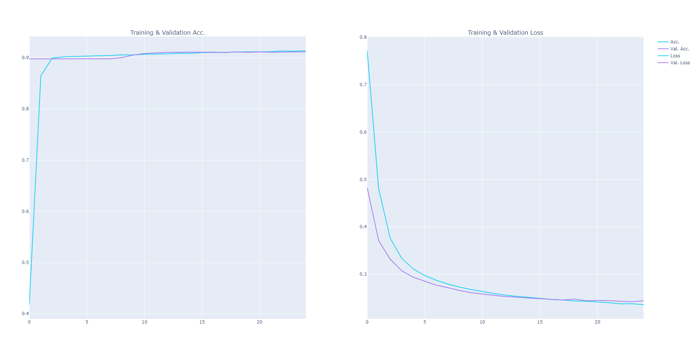

# Making predictions

Currently we have 600 different features to work with and the full data set is made up of 200000 records. It's a medium sized dataset and we have to keep in mind the performance. For the modelling purpose I plan to create a 1:2 blending situation with a NN and LGBM for the best accuracy. To split the data into smaller chunks I'm going to used a stratified K-fold.


## Creating a LGBM

I have a pretty good idea of what I want the LGBM to look like, but I don't exclude the possibility of tuning later if the result is not satisfying. For now we're going to proceed with predefined parameters and create our model.

```Python
# Set params for LGBM
params = {
    'feature_fraction': 0.05,
    'learning_rate': 0.01,
    'max_depth': -1,
    'metric': 'auc',
    'min_data_in_leaf': 80,
    'min_sum_hessian_in_leaf': 10.0,
    'num_leaves': 13,
    'num_threads': 6,
    'tree_learner': 'serial',
    'verbosity': 1,
    'bagging_freq': 5,
    'bagging_fraction': 0.4,
    'boost_from_average': 'false',
    'boost': 'gbdt',
    'objective': 'binary',
}
```

**About parameters:**

- We're using the **gbdt boost** that is optimized for good accuracy, it's the default boosting type, I also considered dart that is optimized for the best accuracy but it has some issues that make it better for other types of datasets
- We're using the **AUC** metric to evaluate the model
- For the best speed, we set the **num_threads** to the number of **real CPU cores**


## Creating a NN

When it comes to the neural network, I have something very simple in mind, I think we won't need anything too special here, although I keep in mind the possibility of using Keras Tuner in the future to get even better accuracy. For now I just spend a few minutes experimenting with parameters and layers, the network gets trained quickly so it wasn't an issue. Below you can see the set-up I created.

```Python
# Define new model
def nn_model(input_dim):
    print('Building the model..')
    model = Sequential()
    model.add(layers.Dense(128, input_dim=input_dim, activation='relu', kernel_regularizer=regularizers.l2(0.005)))
    model.add(layers.BatchNormalization())
    model.add(layers.Dropout(0.2))
    model.add(layers.Dense(64, activation='sigmoid'))
    model.add(layers.Dropout(0.2))
    model.add(layers.Dense(16, input_dim=input_dim, activation='sigmoid', kernel_regularizer=regularizers.l2(0.005)))
    model.add(layers.Dropout(0.2))
    model.add(layers.Dense(1, activation='sigmoid'))

    return model

model = nn_model(input_dim)
opt = tf.keras.optimizers.Adam(learning_rate=0.0001)
model.compile(loss='binary_crossentropy', optimizer=opt, metrics=['accuracy'])
```


Then I simply trained the model using early stopping as a call-back. I used a batch size of 512, validation set being 25% of the data and 25 epochs.

```python
def pred_nn(test_size, batch_size, epochs):
   	(...)
    # Introduce early stopping to prevent overfitting
    early = EarlyStopping(monitor="val_loss",
                          mode="min",
                          patience=9)

    history = model.fit(x_train,
                        y_train,
                        epochs=epochs,
                        batch_size=batch_size,
                        callbacks=[early],
                        validation_data=(x_test, y_test))
    (...)
```


## Evaluating the results

### 1) LGBM Accuracy

```python
(...)
[14000] training's auc: 0.963157        valid_1's auc: 0.902723
[15000] training's auc: 0.965849        valid_1's auc: 0.902878
Early stopping, best iteration is:
[12826] training's auc: 0.959833        valid_1's auc: 0.902914
CV Score:  0.9025011966273266
```


### 2) NN Accuracy by epoch

```python
Epoch 1/25
293/293 [==============================] - 3s 7ms/step - loss: 0.3889 - accuracy: 0.8953 - val_loss: 0.3172 - val_accuracy: 0.8976
Epoch 2/25
293/293 [==============================] - 1s 5ms/step - loss: 0.3137 - accuracy: 0.9001 - val_loss: 0.2934 - val_accuracy: 0.8976
Epoch 3/25
293/293 [==============================] - 1s 5ms/step - loss: 0.2843 - accuracy: 0.9001 - val_loss: 0.2737 - val_accuracy: 0.8976
Epoch 4/25
293/293 [==============================] - 1s 5ms/step - loss: 0.2699 - accuracy: 0.9004 - val_loss: 0.2634 - val_accuracy: 0.8976
Epoch 5/25
293/293 [==============================] - 1s 5ms/step - loss: 0.2623 - accuracy: 0.9011 - val_loss: 0.2573 - val_accuracy: 0.8976
Epoch 6/25
293/293 [==============================] - 1s 5ms/step - loss: 0.2571 - accuracy: 0.9023 - val_loss: 0.2518 - val_accuracy: 0.8976
Epoch 7/25
293/293 [==============================] - 1s 5ms/step - loss: 0.2535 - accuracy: 0.9035 - val_loss: 0.2509 - val_accuracy: 0.8992
Epoch 8/25
293/293 [==============================] - 1s 5ms/step - loss: 0.2509 - accuracy: 0.9053 - val_loss: 0.2491 - val_accuracy: 0.9058
Epoch 9/25
293/293 [==============================] - 2s 5ms/step - loss: 0.2479 - accuracy: 0.9066 - val_loss: 0.2464 - val_accuracy: 0.9087
Epoch 10/25
293/293 [==============================] - 2s 5ms/step - loss: 0.2470 - accuracy: 0.9073 - val_loss: 0.2460 - val_accuracy: 0.9092
Epoch 11/25
293/293 [==============================] - 1s 5ms/step - loss: 0.2448 - accuracy: 0.9085 - val_loss: 0.2458 - val_accuracy: 0.9096
Epoch 12/25
293/293 [==============================] - 1s 5ms/step - loss: 0.2435 - accuracy: 0.9086 - val_loss: 0.2454 - val_accuracy: 0.9105
Epoch 13/25
293/293 [==============================] - 1s 5ms/step - loss: 0.2426 - accuracy: 0.9093 - val_loss: 0.2427 - val_accuracy: 0.9108
Epoch 14/25
293/293 [==============================] - 1s 5ms/step - loss: 0.2411 - accuracy: 0.9101 - val_loss: 0.2424 - val_accuracy: 0.9115
Epoch 15/25
293/293 [==============================] - 1s 5ms/step - loss: 0.2400 - accuracy: 0.9103 - val_loss: 0.2421 - val_accuracy: 0.9114
Epoch 16/25
293/293 [==============================] - 1s 5ms/step - loss: 0.2386 - accuracy: 0.9108 - val_loss: 0.2415 - val_accuracy: 0.9114
Epoch 17/25
293/293 [==============================] - 1s 5ms/step - loss: 0.2381 - accuracy: 0.9114 - val_loss: 0.2425 - val_accuracy: 0.9115
Epoch 18/25
293/293 [==============================] - 1s 5ms/step - loss: 0.2370 - accuracy: 0.9116 - val_loss: 0.2409 - val_accuracy: 0.9115
Epoch 19/25
293/293 [==============================] - 1s 5ms/step - loss: 0.2362 - accuracy: 0.9121 - val_loss: 0.2411 - val_accuracy: 0.9117
Epoch 20/25
293/293 [==============================] - 1s 5ms/step - loss: 0.2350 - accuracy: 0.9121 - val_loss: 0.2405 - val_accuracy: 0.9114
Epoch 21/25
293/293 [==============================] - 1s 5ms/step - loss: 0.2349 - accuracy: 0.9123 - val_loss: 0.2401 - val_accuracy: 0.9112
Epoch 22/25
293/293 [==============================] - 1s 5ms/step - loss: 0.2330 - accuracy: 0.9130 - val_loss: 0.2420 - val_accuracy: 0.9117
Epoch 23/25
293/293 [==============================] - 1s 5ms/step - loss: 0.2327 - accuracy: 0.9127 - val_loss: 0.2415 - val_accuracy: 0.9120
Epoch 24/25
293/293 [==============================] - 1s 5ms/step - loss: 0.2319 - accuracy: 0.9131 - val_loss: 0.2403 - val_accuracy: 0.9117
Epoch 25/25
293/293 [==============================] - 1s 5ms/step - loss: 0.2309 - accuracy: 0.9135 - val_loss: 0.2408 - val_accuracy: 0.9118
```


### 3) NN, Accuracy & loss for validation and test data (ROC plot)




## Blending and saving the submission

The last thing I'm going to do is blend the predictions and save the predictions. I'm adding the date to the file name because I will probably run more tests in the future that include methods from the next section.

```Python
# Blend and created a final dataframe submission
result_df = pd.concat([nn_result, lgbm_result], axis=1, join="inner")

def blend(nn_pred, lgbm_pred):
    return (0.75 * nn_pred) + (0.25 * lgbm_pred)


blended = result_df.apply(lambda row: row['LGBM_pred'] + row['NN_pred'], axis=1)
blended_dict = {'ID_code': ID_code, 'target': blended}
blended_df = pd.DataFrame(data=blended_dict)

print(blended_df.head())

# Save the submission
date = datetime.today().strftime('%Y-%m-%d')
submission_name = '../data/results/submission_' + date + '.csv'
pd.DataFrame(blended_df).to_csv(submission_name, index=False)
```

```Python
  ID_code    target
0  test_0  0.144619
1  test_1  0.334349
2  test_2  0.167359
3  test_3  0.417251
4  test_4  0.108481
```


## What could go better?

Now that we saw what our models can do, it's only right to look back at the process and see if there can be any improvements made. The competition originally took a few months, I tried to get the result a little bit faster (5-7 days) so there is a few additional things that people discovered and could help to achieve better accuracy. Before starting I only knew to look for the "magic", now seeing notebooks of various Kagglers I can see that there is a little bit more to it.

Personally, I struggled to break the 91% barrier, and I think it's possible to get a better result if following changes/features were made:

- Data augmentation, allowing the new features to interact with the original ones ([200 Magical Models by Chris Deotte](https://www.kaggle.com/cdeotte/200-magical-models-santander-0-920#Maximizing-Magic-Feature))
- Better tuning for the LGBM model, the Keras one seems to be pretty well fitted already
- Verifying the synthetic data ([List of Fake Samples and Public/Private LB split by YaG320](https://www.kaggle.com/yag320/list-of-fake-samples-and-public-private-lb-split))

